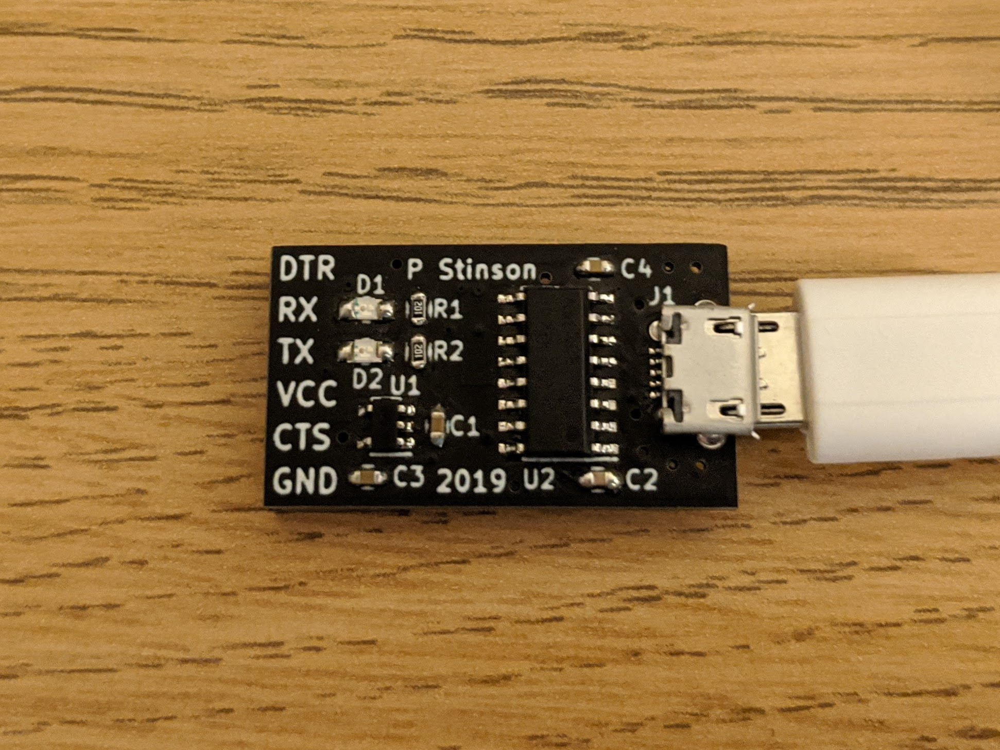
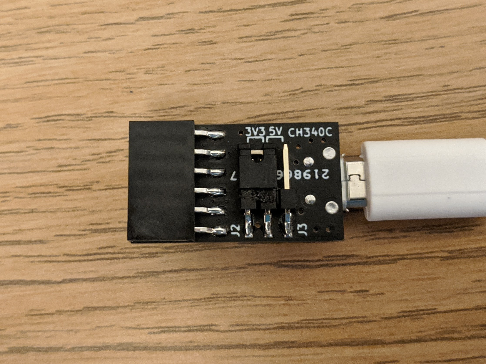

# USB Serial Adaptor
Simple USB to UART adaptor using the low cost CH340 IC.

The board features a Micro USB B connector for connection to a computer and a six pin 0.1 inch pitch header, with a connection scheme matching that of several existing USB serial boards and cables. The power and signal voltage of the UART connection is selectable between 5V and 3.3V via a header on the rear of the board. 3.3V is supplied by an onboard LDO which regulates down the 5V from the USB connection. Indicator LEDs for RX and TX activity are also included.

